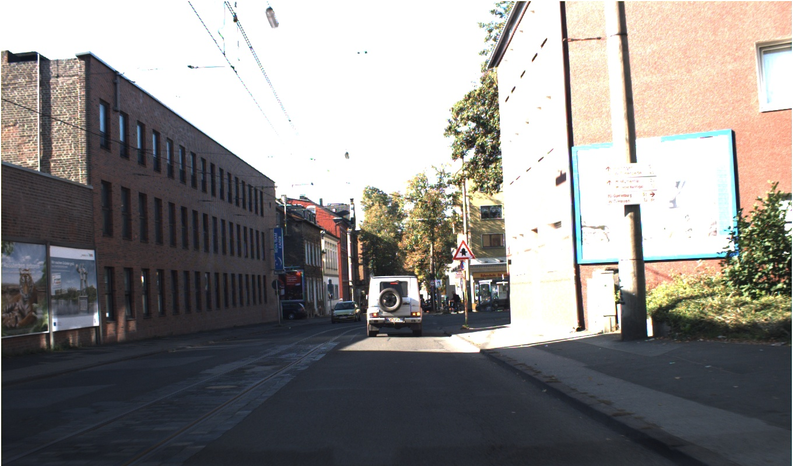
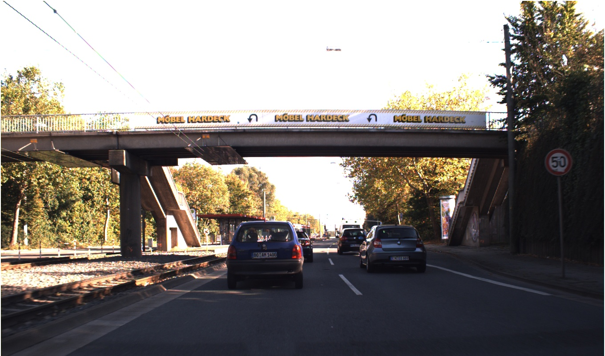
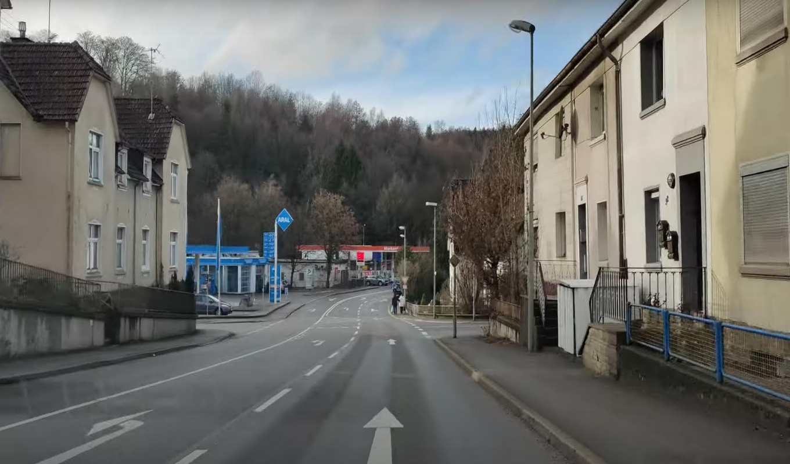
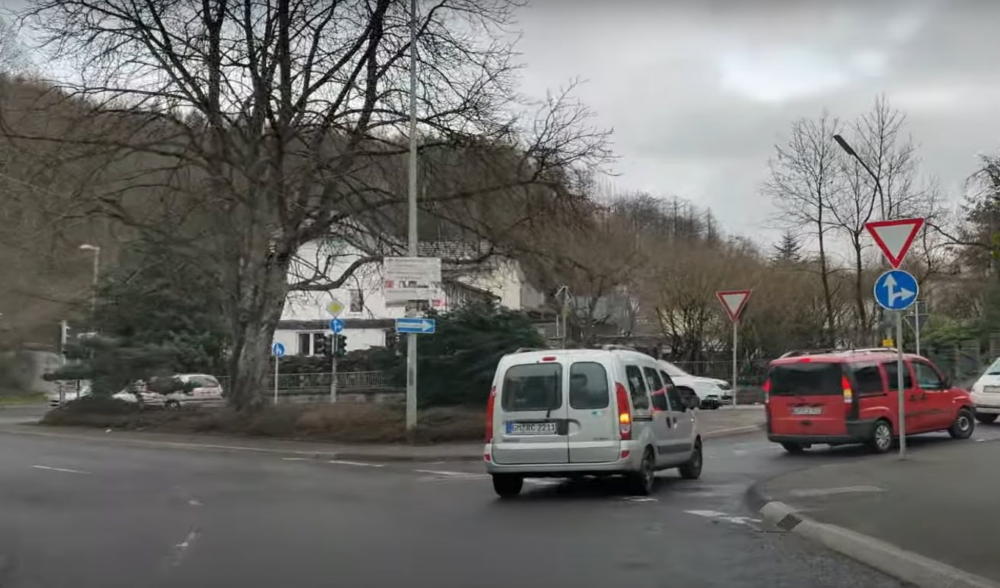
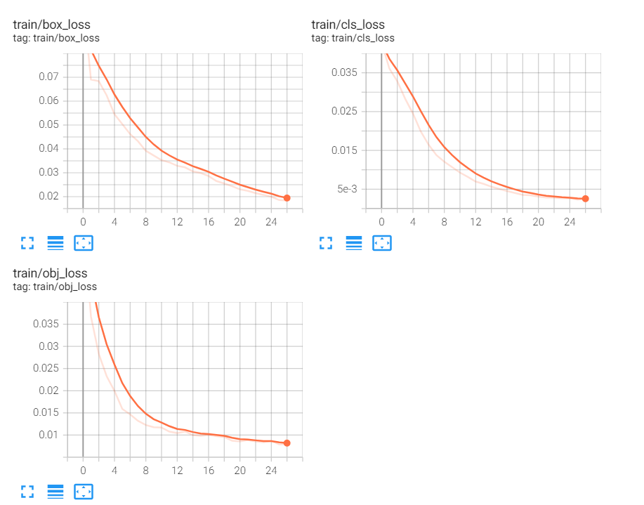
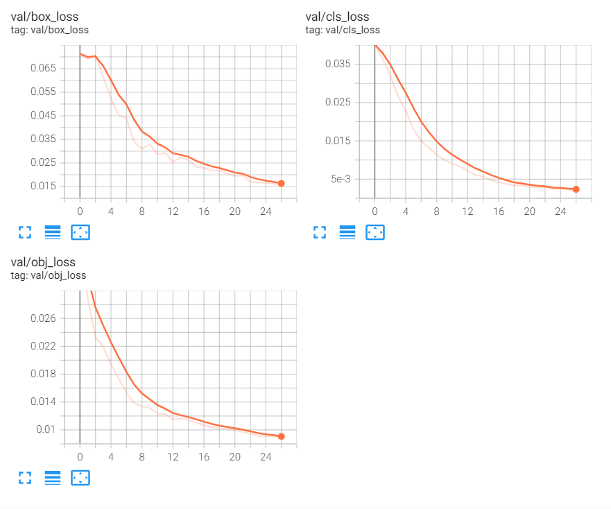
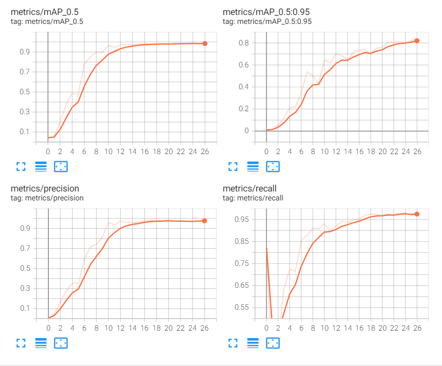
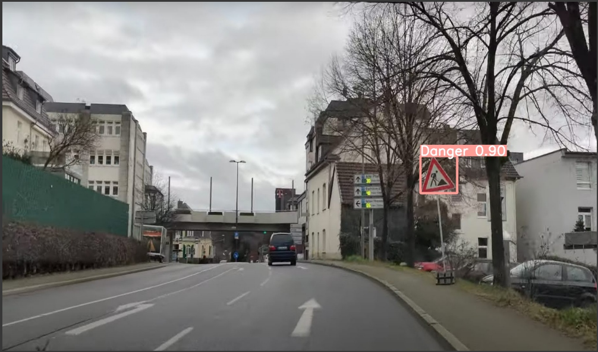
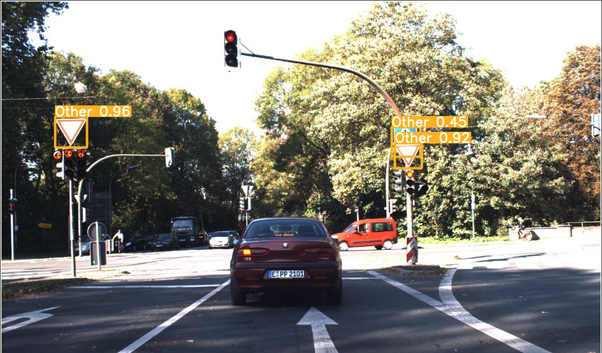

# TrafficSign-DetectionAndRegconition-YOLOv5
- Dataset: Mix between GTSDB + data crawled from youtube video. 4 class: Prohibitory, Mandatory, Danger, Other
- GTSDB images:

- Crawled images:

- Result:

- Test:

